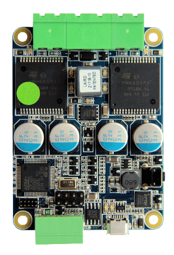
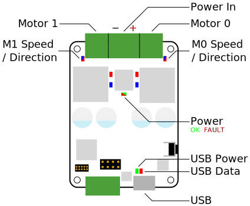

Motor Board v4
==============

The Motor Board can be used to control two 12V DC motors.

The speed and direction of the two outputs are controlled independently through the USB interface.
The USB interface is isolated from the rest of the board to prevent damage to the host in the case of a board failure.
Due to this isolation the board must have power applied to the power connector, from the motor rail on the power board, to function.
If the board does not have power applied to the power connector then you will be unable to communicate with the board.

Board Diagram
----------------

Connectors
----------

There are two motor outputs on the board, labelled 0 and 1. These can be controlled over the USB connection and can also have their polarity reversed to turn a motor in reverse.
The outputs can also be put into ``BRAKE``, where the two poles of the motor are connected over a rheostat. This is known as rheostatic or dynamic braking.

There are several other connectors that are unmarked. One is reserved for future use, and the other is a 5V UART connection.

Indicators
----------

+----------------------------+-------------------------------------------------------+------------------------+
| LED                        | Meaning                                               | Initial power-up state |
+============================+=======================================================+========================+
| Power                      | Green when powered                                    | Green                  |
|                            |                                                       |                        |
|                            | Red when input polarity is reversed                   |                        |
+----------------------------+-------------------------------------------------------+------------------------+
| M{0,1} Speed / Direction   | Brightness indicates speed.                           | Off                    |
|                            |                                                       |                        |
|                            | Colour Indicates Direction                            |                        |
+----------------------------+-------------------------------------------------------+------------------------+
| USB Power                  | The USB interface is powered                          | On                     |
+----------------------------+-------------------------------------------------------+------------------------+
| USB Data                   | Data is being transferred to/from the board           | Off                    |
+----------------------------+-------------------------------------------------------+------------------------+

Controls
--------

The motor board is largely controlled over the serial interface. There is one physical push button on the board that is a firmware reset button.

USB interface
-------------

Unlike other SR v4 boards, the STM32 on the motor board does not directly communicate over USB. Instead there is an FTDI USB serial interface chip.

The FTDI Chip has vendor ID ``0403`` and product ID ``6001``. It can be further filtered by the USB ``product`` field.

Given that the appropriate drivers are available on your computer, it should appear as a standard serial interface. You should open this interface at a baud rate of ``1000000bps``.

Serial Commands
~~~~~~~~~~~~~~~

8 bit commands should be sent over the serial interface to the board.

The following commands are supported:

+---------------+-------------------+---------------------------+
| Decimal Value | Unicode           | Purpose                   |
+===============+===================+===========================+
| 0             | ``\x00``          | Reset the STM32           |
+---------------+-------------------+---------------------------+
| 1             | ``\x01``          | Send the firmware string  |
+---------------+-------------------+---------------------------+
| 2             | ``\x02``          | Set Motor 0 value         |
+---------------+-------------------+---------------------------+
| 3             | ``\x03``          | Set Motor 1 value         |
+---------------+-------------------+---------------------------+
| 4             | ``\x04``          | Reset into the Bootloader |
+---------------+-------------------+---------------------------+

Setting Motor Speeds
~~~~~~~~~~~~~~~~~~~~

The value of a motor can be set by sending the appropriate command, and then a second byte as follows:

+---------------+-------------------------------------------------------------+
| Decimal Value | Purpose                                                     |
+===============+=============================================================+
| 0             | Do nothing                                                  |
+---------------+-------------------------------------------------------------+
| 1             | Coast the motor                                             |
+---------------+-------------------------------------------------------------+
| 2             | Brake the motor                                             |
+---------------+-------------------------------------------------------------+
| 3 - 127       | Set speed of motor to negative.                             |
+---------------+-------------------------------------------------------------+
| 128           | Set speed of motor to 0                                     |
+---------------+-------------------------------------------------------------+
| 129 - 255     | Set speed of motor positive. Subtract 128 to get the value. |
+---------------+-------------------------------------------------------------+

Firmware String
~~~~~~~~~~~~~~~

When the firmware string is requested from the motor board, you will receive bytes of the following format over the serial interface: ``MCV4B:3\n``.

The number after the colon represents the firmware version of the board.

udev Rule
---------

If you are connecting the Motor Board to a Linux computer with udev, the following rule can be added in order to access
the Motor Board interface without root privileges:

.. parsed-literal::
    SUBSYSTEM=="tty", DRIVERS=="ftdi_sio", ATTRS{interface}=="MCV4B", GROUP="plugdev", MODE="0666""

It should be noted that ``plugdev`` can be changed to any Unix group of your preference.

Case Dimensions
---------------

The case measures 70x84x20mm. Don't forget that the cables will stick out.

Specification
-------------

+---------------------------------------+--------------+
| Parameter                             | Value        |
+=======================================+==============+
| Nominal input voltage                 | 11.1V ± 15%  |
+---------------------------------------+--------------+
| Absolute maximum input voltage        | 16V          |
+---------------------------------------+--------------+
| Minimum input voltage                 | 9V           |
+---------------------------------------+--------------+
| Output voltage                        | 11.1V ± 15%  |
+---------------------------------------+--------------+
| Continuous output current per channel | 10A          |
+---------------------------------------+--------------+
| Peak output current                   | 20A          |
+---------------------------------------+--------------+
| UART connection voltage               | 3.3 - 5V     |
+---------------------------------------+--------------+

Designs
-------

You can access the schematics and source code of the firmware on the motor board in the following places.
You do not need this information to use the board but it may be of interest to some people.

- `Full Schematics`_
- `Firmware source`_
- `Hardware designs`_

.. _Full Schematics: https://www.studentrobotics.org/resources/kit/motor-schematic.pdf
.. _Firmware source: https://github.com/j5api/sr-motor-v4-fw
.. _Hardware designs: https://www.studentrobotics.org/cgit/boards/motor-v4-hw.git/

.. Note:: Some of the above documentation has been taken and modified from the `Student Robotics`_ docs, which can be found here_.

.. _Student Robotics: https://studentrobotics.org/
.. _here: https://github.com/srobo/docs/blob/master/kit/motor_board.md