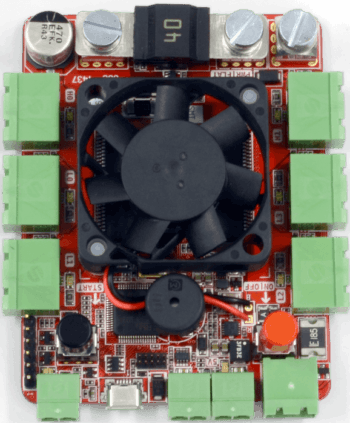
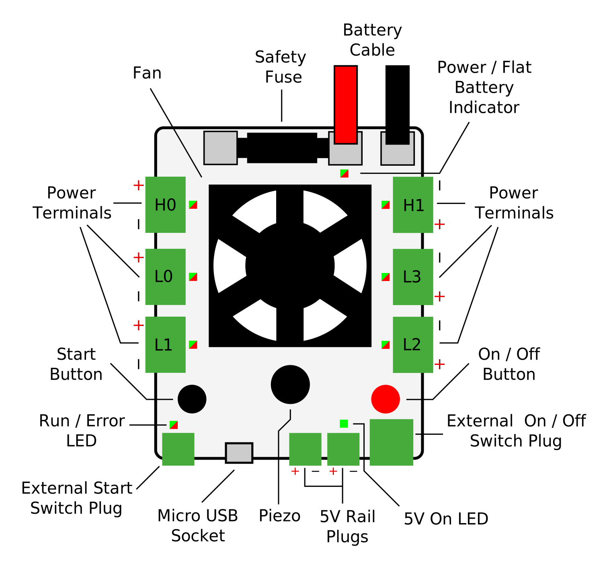

Power Board v4
==============

The Power Board distributes power to the SR kit from the battery. It
provides six individual general-purpose power outputs along with two
low current 5V power outputs.

It also holds the internal On|Off switch for the whole robot as well as
the Start button which is used to start your robot code running.

Board Diagram
----------------

Connectors
----------

There are six power output connectors on the board, labelled L0–L3, H0,
and H1. These can be enabled over USB and supply around 11.1V (±15%).
The “H” connectors will supply more current than the “L” connectors.

The 5V connectors can be used to connect low-current devices that take
5V inputs.

Finally, there are connectors for external Start and On|Off switches.
You may connect any push-to-make latching switch for the On|Off button,
or a push-to-make button for the start button.

.. Note::

   If you intend to use only the internal On|Off switch, you must
   connect a CamCon to the On|Off connector with a wire connecting one
   pin to the other pin on the same connector.

Indicators
----------

+----------------+--------------------------------+---------------------+
| LED            | Meaning                        | Initial power-up    |
|                |                                | state               |
+================+================================+=====================+
| PWR|FLAT       | Green when powered             | Green               |
|                |                                |                     |
|                | Flashing red and green when    | Green               |
|                | the battery is low             |                     |
+----------------+--------------------------------+---------------------+
| 5V             | Green when 5V is being         | Green               |
|                | supplied                       |                     |
+----------------+--------------------------------+---------------------+
| H0-1, L0-3     | Green when the output is on.   | Off                 |
|                |                                |                     |
|                | Red when the output’s          |                     |
|                | current limit is reached       |                     |
+----------------+--------------------------------+---------------------+
| RUN|ERROR      | Orange on power-up, or USB     | Orange              |
|                | reset Flashing green when      |                     |
|                | ready to run Solid green when  |                     |
|                | running or booting             |                     |
+----------------+--------------------------------+---------------------+

On power-up, the Power Board will emit some beeps, which are related to
the version of the firmware it has installed.

If the Power Board starts beeping (and all the outputs turn off) then
this means that the whole board’s current limit has been triggered.

Controls
--------

======= ==========================================================================
Control Use
======= ==========================================================================
ON|OFF  Turns the power board on, when used in conjunction with an external switch
START   Intended to start the robot. The state is accessible over USB.
======= ==========================================================================

USB Interface
-------------

The Power Board is controlled over USB by sending requests to the control endpoint.

.. code-block:: python

    ctrl_transfer(
        0x00,
        64,
        wValue=req_val,
        wIndex=command.code,
        data_or_wLength=req_data,
    )

+---------------+-------+
| Parameter     | Value |
+===============+=======+
| bmRequestType | 0x00  |
+---------------+-------+
| bRequest      | 64    |
+---------------+-------+

There are a list of ids defined in the firmware of the power board that will let you read and write values to it.

It is recommended to read the source to further understand how to control this device.

It should also be noted that as the control endpoint ``0x00`` is used to send data to this device, it is not actually
compliant with the USB 2.0 specification.

Case Dimensions
---------------

The case measures 83x99x24mm. Don't forget that the cables will stick out.

Specification
-------------

===================================== ===========
Parameter                             Value
===================================== ===========
Main battery fuse current             40A
Overall current limit                 30A
High current outputs (H0-1)           20A
Low current outputs (L0-3)            10A
Main output voltage (nominal)         11.1V ± 15%
Maximum output current per 5V channel 1A
===================================== ===========

Designs
-------

You can access the schematics and source code of the firmware for the
power board in the following places. You do not need this information to
use the board but it may be of interest to some people.

- `Full Schematics`_
- `Firmware source`_
- `Hardware designs`_

.. _Full Schematics: https://www.studentrobotics.org/resources/kit/power-schematic.pdf
.. _Firmware source: https://github.com/j5api/sr-power-v4-fw
.. _Hardware designs: https://www.studentrobotics.org/cgit/boards/power-v4-hw.git/

.. Note:: Some of the above documentation has been taken and modified from the `Student Robotics`_ docs, which can be found here_.

.. _Student Robotics: https://studentrobotics.org/
.. _here: https://github.com/srobo/docs/blob/master/kit/power_board.md