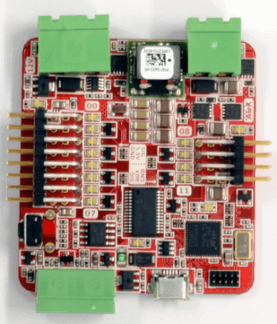
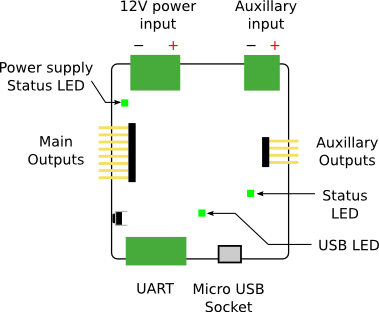

Servo Board v4
==============

The Servo Board can be used to control up to 12 RC servos.
Many devices are available that can be controlled as servos, such as RC motor speed controllers, and these can also be used with the board.

Other devices that are controllable using PWM outputs can also be attached to the board outputs.

Board Diagram
-------------

Indicators
----------

+---------------+--------------------------------------------------------------------------------------------------+------------------------+
| LED           | Meaning                                                                                          | Initial power-up state |
+===============+==================================================================================================+========================+
| Power         | The board is powered over USB.                                                                   | On                     |
+---------------+--------------------------------------------------------------------------------------------------+------------------------+
| 5.5V On       | There is 5.5V power on the board. This usually indicates that the 12V connector rail is powered. | Off                    |
+---------------+--------------------------------------------------------------------------------------------------+------------------------+
| Aux On        | There is auxiliary power on the board.                                                           | Off                    |
+---------------+--------------------------------------------------------------------------------------------------+------------------------+
| Status        | The board has successfully booted.                                                               | On                     |
+---------------+--------------------------------------------------------------------------------------------------+------------------------+
| Error         | An error has occurred. This often indicates a disconnection of the 12V connector.                | Off                    |
+---------------+--------------------------------------------------------------------------------------------------+------------------------+
| Outputs 00-11 | Currently unimplemented in firmware.                                                             | Off                    |
+---------------+--------------------------------------------------------------------------------------------------+------------------------+

Controls
--------

The servo board is largely controlled over the USB interface. There is one physical push button on the board that is a firmware reset button.

USB Interface
-------------

The Vendor ID is ``1bda`` (University of Southampton) and the product ID is ``0011``.

The Servo Board is controlled over USB by sending requests to the control endpoint.

.. code-block:: python

    ctrl_transfer(
        0x00,
        64,
        wValue=req_val,
        wIndex=command.code,
        data_or_wLength=req_data,
    )

+---------------+-------+
| Parameter     | Value |
+===============+=======+
| bmRequestType | 0x00  |
+---------------+-------+
| bRequest      | 64    |
+---------------+-------+

There are a list of ids defined in the firmware of the servo board that will let you read and write values to it.

It is recommended to read the source to further understand how to control this device.

It should also be noted that as the control endpoint ``0x00`` is used to send data to this device, it is not actually
compliant with the USB 2.0 specification.

udev Rule
---------

If you are connecting the Servo Board to a Linux computer with udev, the following rule can be added in order to access
the Servo Board interface without root privileges:

.. parsed-literal::
    SUBSYSTEM=="usb", ATTRS{idVendor}=="1bda", ATTRS{idProduct}=="0011", GROUP="plugdev", MODE="0666"

It should be noted that ``plugdev`` can be changed to any Unix group of your preference.

Connectors
----------

There are 8 servo connections on the left-side of the board, and 4 on the right. Servo cables are connected vertically, with 0V (the black or brown wire) at the bottom of the board.

For the servo board to operate correctly, you must connect it to the 12V power
rail from the power board. A green LED will light next to the servo board 12V
connector when it is correctly powered.

Case Dimensions
---------------

The case measures 68x68x21mm. Don't forget that the cables will stick out.

Specification
-------------

+-------------------------------------+--------------+
| Parameter                           | Value        |
+=====================================+==============+
| Number of servo channels            | 12           |
+-------------------------------------+--------------+
| Nominal input voltage               | 11.1V ± 15%  |
+-------------------------------------+--------------+
| Output Voltage                      | 5.5V         |
+-------------------------------------+--------------+
| Maximum total output current [#]_   | 10A          |
+-------------------------------------+--------------+

.. [#] If the auxiliary input is connected, outputs 8-11 have an independent maximum current.

Designs
-------

You can access the schematics and source code of the firmware on the servo board in the following places.
You do not need this information to use the board but it may be of interest to some people.

- `Full Schematics`_
- `Firmware source`_
- `Hardware designs`_

.. _Full Schematics: https://www.studentrobotics.org/resources/kit/servo-schematic.pdf
.. _Firmware source: https://github.com/j5api/sr-servo-v4-fw
.. _Hardware designs: https://github.com/srobo/servo-v4-hw

.. Note:: Some of the documentation in this section has been modified from Student Robotics. See here_ for more information.

.. _here: LICENSE.html